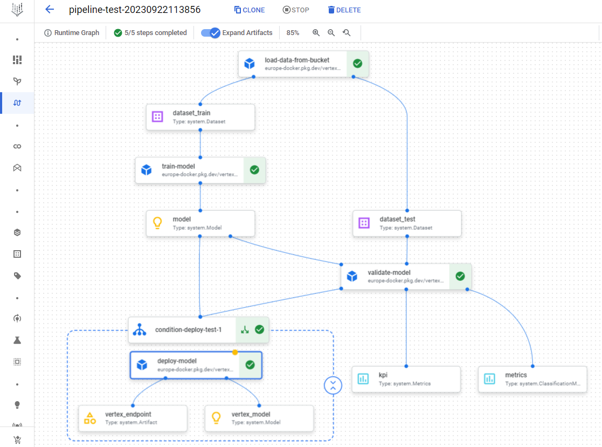

# vertex-pipeline-demo
An updated version of creating an MLOps workflow using Vertex Pipelines.

## How to use the code
The notebook (`pipeline.ipynb`) is created and meant to be run inside a [Vertex Workbench](https://cloud.google.com/vertex-ai/docs/workbench/introduction). Ensure you follow the instructions inside the notebook to be able to replicate the pipeline in your own GCP project.

**NOTE:** You also need to ensure your project, specifically its default system account, is configured to run Vertex Pipelines. Please follow the instructions mentioned [here](https://cloud.google.com/vertex-ai/docs/pipelines/configure-project) to set it up. Using the project ID and the bucket name you chose, replace the placeholder values in the first cell.

## Example output

Once the notebook successfully runs, you can open the [pipelines page](https://console.cloud.google.com/vertex-ai/locations/eu-west4/pipelines/runs/) in Vertex AI.

## Acknowledgement
This notebook was inspired from the example showed [here](https://github.com/anabild/mlops/blob/main/notebook/ExampleWine.ipynb). The need to make a lot of modifications to make the pipeline work gave birth to this repository.
